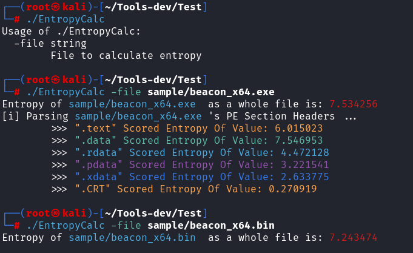
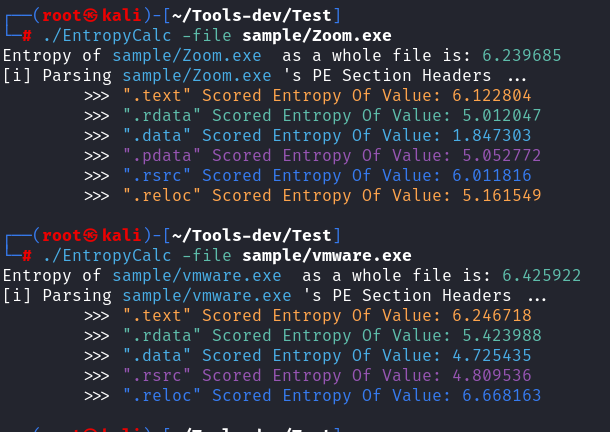

# EntropyCalc_Go

[英文] [简体中文](https://github.com/yutianqaq/EntropyCalc_Go)

Golang Implementation of a Binary File Entropy Calculator, as featured in the Binary Entropy Reduction section of [MalDev Academy](https://maldevacademy.com/).

It helps gauge file entropy, with legitimate software usually having entropy between 4.8 and 7.2, while malicious software tends to exceed 7.2 (highlighted in red).

This tool can be used in conjunction with [Supernova_CN](https://github.com/yutianqaq/Supernova_CN) for encrypting shellcode, thereby reducing the entropy.

## Installation

### Build from Source

```bash
git clone https://github.com/yutianqaq/EntropyCalc_Go
cd EntropyCalc_Go
go build
```


### Download Binary Version

[https://github.com/yutianqaq/EntropyCalc/releases](https://github.com/yutianqaq/EntropyCalc_Go/releases)

## Usage

```
bash
./EntropyCalc -file filename
```

Malicious software is identified with red color highlighting in the entropy values.



Legitimate software is identified with green color highlighting in the entropy values.



# References
- https://practicalsecurityanalytics.com/file-entropy/ 
- https://rosettacode.org/wiki/Entropy#Go 
- [MalDev Academy](https://maldevacademy.com/)

